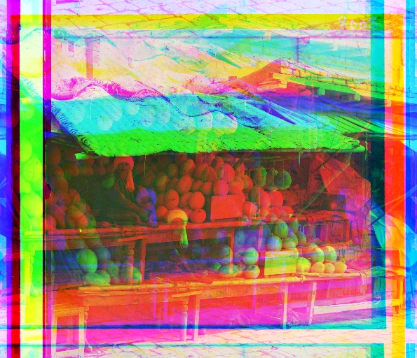
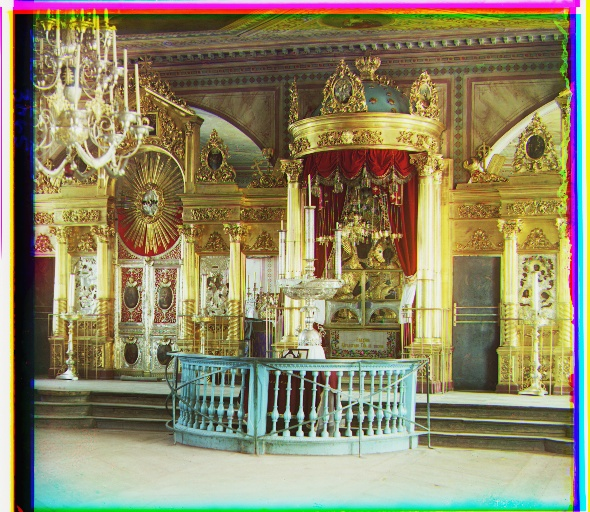
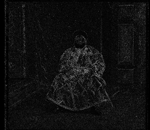

# Images of the Russian Empire: Colorizing the Prokudin-Gorskii photo collection

## Description
Sergei Mikhailovich Prokudin-Gorskii had an idea to create colored images
using the tools available to him. His idea was simple: record three exposures
of every scene onto a glass plate using a red, a green, and a blue filter.
Never mind that there was no way to print color photographs until much later
-- he envisioned special projectors to be installed in "multimedia" classrooms
all across Russia where the children would be able to learn about their vast
country. The result was a series of photos that are for the red, green, and
blue channels. The goal of this project is to align the channels and create a
colored image.

This project experiments with 3 different alignment strategies: Euclidean
Distance (Mean Square Difference), Normalized Cross Correlation, and Sobel Edge
Detection.

<!-- ## Method
Let the two channels be $c_1, c_2$. Let the shift functions be $\text{shift}_x(k, c)$, $\text{shift}_y (k, c)$, which shifts an image $c$ in the $x$ and $y$ directions by $k$ pixels.

### Euclidean Distance (Mean Squared Difference)
For this method we compute the Euclidean Distance bewtween the channels. We seek to minimize this distance due to our assumption that bright areas should be bright across all channels. Thus let the shifted channel 1 be $c_1'$, then
$$c_1' = \text{shift}_y(y, \text{shift}_x(x, c_1)) $$
We then find
$$(x, y) = \text{argmin}_{x, y} \sqrt{(c_1 - c_2)^2}$$
where $x, y \in [-15, 15]$

### Normalized Cross Correlation (NCC)
For this method we compute the Cross Correlation. We seek to maximize this since we believe that areas in which the image is bright __relative__ to the rest of the image should be __relatively__ bright in all channels. This improves upon MSD since it there may be images that are brighter for an entire channel, which throws off the metric. Let the normalized channels be $c_1', c_2'$ 
$$c_i = \frac{c_i}{||c_i||} - 0.5 \times \vec{1}$$
This normalizes the mean and variance of the vectors.
let the shifted channel 1 be $c_1''$, then
$$c_1' = \text{shift}_y(y, \text{shift}_x(x, c_1')) $$

We then find
$$(x, y) = \text{argmax}_{x, y} c_1'' \cdot c_2'$$
where $x, y \in [-15, 15]$

### Sobel Edge Detection (NCC)
For this method we still compute the Cross Correlation and seek to maximize this. However, the features are no longer the pixel values, but the edge features created by the Sobel Edge Extractor. Let the extracted features channels be $c_1', c_2'$ 
$$c_i = \text{Sobel}(c_1)$$
Since Sobel already normalizes, we do not need to normalize again.
Let the shifted channel 1 be $c_1''$, then
$$c_1' = \text{shift}_y(y, \text{shift}_x(x, c_1')) $$

We then find
$$(x, y) = \text{argmax}_{x, y} c_1'' \cdot c_2'$$
where $x, y \in [-15, 15]$ -->

## Image Processing Results
MSD: Mean Squared Difference

NCC: Normalized Cross Correlation

SED: Sobel Edge Detection

| MSD| NCC  | SED |
| - | ------------- | ------------- |
|    Red-Blue Shift: [50, 22]   Green-Blue Shift: [-270, 254] |    Red-Blue Shift: [-3, 7]   Green-Blue Shift: [107, 17] |    Red-Blue Shift: [49, 24]   Green-Blue Shift: [105, 41] |
|    Red-Blue Shift: [25, 3]   Green-Blue Shift: [60, -5] |    Red-Blue Shift: [0, -5]   Green-Blue Shift: [52, -6] |    Red-Blue Shift: [25, 3]   Green-Blue Shift: [58, -4] |
|    Red-Blue Shift: [56, 12]   Green-Blue Shift: [112, 12] |    Red-Blue Shift: [52, 5]   Green-Blue Shift: [108, 7] |    Red-Blue Shift: [59, 16]   Green-Blue Shift: [115, 12] |
|    Red-Blue Shift: [260, 270]   Green-Blue Shift: [-138, -198] |    Red-Blue Shift: [83, 4]   Green-Blue Shift: [177, 8] |    Red-Blue Shift: [79, 9]   Green-Blue Shift: [176, 14] |
|    Red-Blue Shift: [51, 27]   Green-Blue Shift: [109, 37] |    Red-Blue Shift: [52, 22]   Green-Blue Shift: [108, 35] |    Red-Blue Shift: [50, 28]   Green-Blue Shift: [108, 35] |
|    Red-Blue Shift: [-6, -8]   Green-Blue Shift: [84, 32] |    Red-Blue Shift: [111, -7]   Green-Blue Shift: [107, 1] |    Red-Blue Shift: [53, 5]   Green-Blue Shift: [84, 28] |
|    Red-Blue Shift: [270, 165]   Green-Blue Shift: [268, 141] |    Red-Blue Shift: [42, 16]   Green-Blue Shift: [89, 22] |    Red-Blue Shift: [39, 16]   Green-Blue Shift: [88, 23] |
|    Red-Blue Shift: [-30, 250]   Green-Blue Shift: [-9, 172] |    Red-Blue Shift: [50, -2]   Green-Blue Shift: [130, -5] |    Red-Blue Shift: [74, 25]   Green-Blue Shift: [175, 37] |
|    Red-Blue Shift: [-270, -231]   Green-Blue Shift: [-270, -226] |    Red-Blue Shift: [118, -3]   Green-Blue Shift: [120, 7] |    Red-Blue Shift: [56, 11]   Green-Blue Shift: [118, 10] |
|    Red-Blue Shift: [-270, -222]   Green-Blue Shift: [-270, -222] |    Red-Blue Shift: [33, -11]   Green-Blue Shift: [140, -26] |    Red-Blue Shift: [33, -11]   Green-Blue Shift: [140, -27] |
|    Red-Blue Shift: [54, 8]   Green-Blue Shift: [-138, -14] |    Red-Blue Shift: [57, -6]   Green-Blue Shift: [123, -17] |    Red-Blue Shift: [57, 9]   Green-Blue Shift: [121, 13] |
|    Red-Blue Shift: [-3, 2]   Green-Blue Shift: [3, 2] |    Red-Blue Shift: [-6, 0]   Green-Blue Shift: [9, 1] |    Red-Blue Shift: [-3, 2]   Green-Blue Shift: [3, 2] |
|    Red-Blue Shift: [3, 2]   Green-Blue Shift: [7, 3] |    Red-Blue Shift: [3, 2]   Green-Blue Shift: [6, 3] |    Red-Blue Shift: [3, 2]   Green-Blue Shift: [6, 3] |
|    Red-Blue Shift: [-50, -138]   Green-Blue Shift: [-176, 172] |    Red-Blue Shift: [1, -1]   Green-Blue Shift: [7, -1] |    Red-Blue Shift: [5, 2]   Green-Blue Shift: [12, 3] |

We observe that the MSD alignment strategy fails in Emir, Melons, and Lady. This is due to the luminencne in the RGB channels not aligning, and the strategy going off course because of it. We also try multiscale alignment even for smaller JPG's. This leads to compounding errors for smaller images for the MSD strategy. Cross correlation improves this, and no image is greatly color shifted like MSD. However, in Emir's photo for example, the channels are still visibily misaligned. This is most likely due to the differently thick edges lining up, messing up the alignment of the image subject. We improved results by suing an edge detector. Since all 3 channels describe the same subject, we can ssume that the object's edges will align. By using the Sobel Edge extractor, we can extract edges and then compute Cross Correlation on this edge feature. This leads to much better results as shown in the above table.

## Edge Detector
Below are the Sobel features of the Red, Green, and Blue channels for Emir

## Automatic Contrast
For automatic contrast, we normalize the histogram to both linear and sigmoid distributions. 
To achieve this, we first compute the percentile of a pixel in its channel relative to the rest of the image. Then we replace its value by the the value of our function at the point of that percentile.
If a pixel is at the 50 percentile, then if we use the linear case, then its value should be $0.5 \times 255 = 128$ (rounded to the nearest integer). The linear function uses a linear function to create the histogram function, and the sigmoid one uses a sigmod function.

Below we test our method on 3 images downloaded from the Prokudin-Gorskii collection.

| Original |  Uncorrected  | Linear Contrast | Sigmoid Contrast |
| ------------- | ------------- | ------------- | -------------|
|  |  |  | |
|  |  |  | |
|  |  |  | |

## Run Time
| Method     | Runtime (all 14 images)|
| ------------- | ------------- |
| MSD Minimization | 04:37 | 
| Normalized CC | 09:45 | 
| Sobel Edge detection| 06:47 | 

MSD comptues the fastest, followed by Sobel, and NCC computes the slowest.